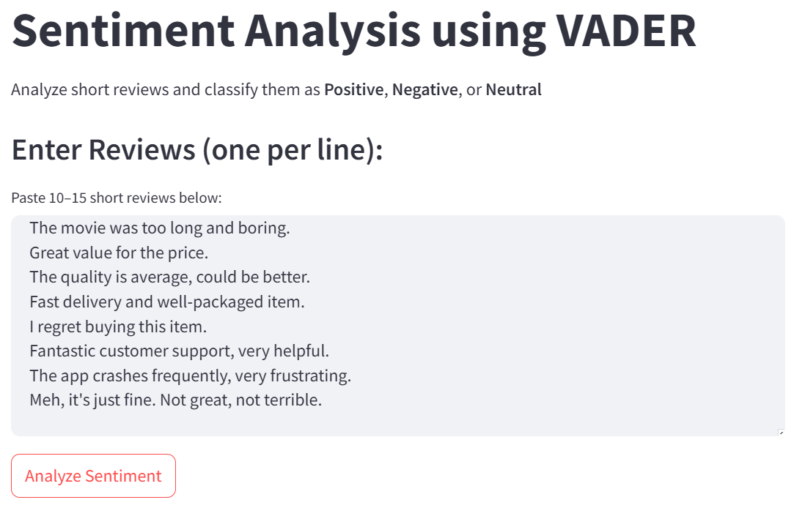
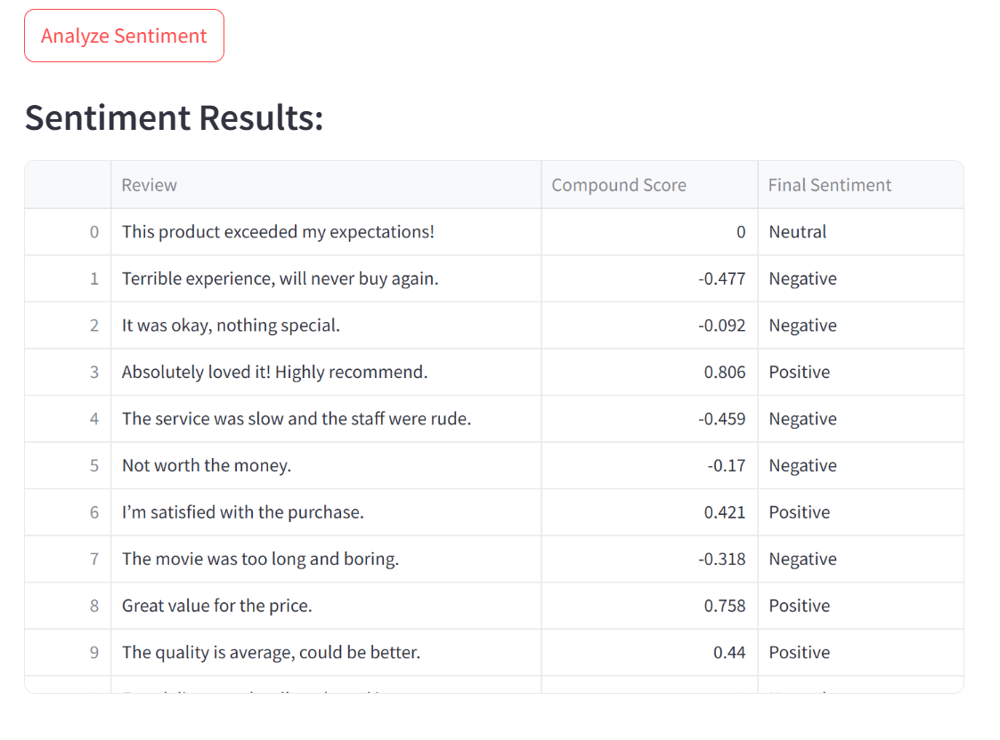

## Sentiment Analysis Using VADER 
This project is a lightweight Streamlit web app that performs sentiment analysis on short text reviews (e.g., product or movie reviews) using the VADER (Valence Aware Dictionary and sEntiment Reasoner) sentiment analysis tool from the NLTK library.

### 🔍 Features
- Analyze 10–15 short English reviews
- Get real-time sentiment scores (Compound)
- Automatically classify as Positive, Negative, or Neutral
- Clean, interactive web interface built with Streamlit

### 📦 Tools & Libraries
- Python 3.x
- Streamlit
- NLTK (VADER)

### 🚀 How to Use
1. Paste your text reviews into the input box
2. Click "Analyze Sentiment"
3. View the results in a dynamic table

### 📖 Sentiment Rules (Based on VADER Compound Score)
- **Positive**: score > 0.05  
- **Negative**: score < -0.05  
- **Neutral**: between -0.05 and 0.05  

